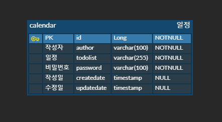

# 일정관리 앱 프로그램 Basic 레벨 (Calendar)


-blue)


- ### [CalendarProject API 명세서 ( 클릭 )](https://documenter.getpostman.com/view/23971624/2sAXqzWyFD) 


- ### <span style="color: lightblue"> CalendarProject ERD
  


## 개요 (Overview)
일정 관리 어플리케이션은 사용자가 일정을 등록하고, 수정하거나 삭제하며,<br>
등록된 일정을 조건별로 필터링하고 검색할 수 있는 기능을 제공합니다.<br><br>
사용자는 작성자명과 수정일을 조건으로 등록된 일정을 전체 조회 검색할 수 있으며,<br>
특정 ID로 단건 조회도 가능합니다.

${\textsf{\color{gray}프론트엔드 디자인은 추후 업데이트 예정입니다.}}$

<br><br>
## 주요 기능 (Key Features)
### 1. 일정 생성
- 사용자는 새로운 일정을 생성할 수 있습니다.
- 일정 생성 시 작성자명, 비밀번호, 할 일 내용(To-do List)을 입력할 수 있습니다.
- 일정 생성 시 작성 날짜, 수정 날짜는 자동으로 입력 됩니다.
### 2. 전체 일정 조회 (검색)
- 모든 일정을 조회할 수 있습니다.
- 작성자명과 수정일을 입력하여 특정 조건에 맞는 일정을 검색할 수 있습니다.
### 3. 단건 일정 조회 (검색)
- 특정 ID를 입력하여 해당 조건에 맞는 일정을 검색할 수 있습니다.
- 단건 조회는 ID 기반으로 일정 하나만을 조회합니다.
### 4. 일정 수정
- 사용자는 일정의 내용을 수정할 수 있습니다.
- 일정 수정 시, 작성자명, 할 일 내용(To-do List)만을 수정할 수 있습니다.
- 일정 수정 시, 올바른 비밀번호를 입력해야만 수정이 가능합니다.
- 일정 수정이 완료 되었을때, 수정 날짜는 자동으로 갱신 됩니다.
### 5. 일정 삭제
- 사용자는 일정의 비밀번호를 입력하여 특정 일정을 삭제할 수 있습니다.
- 삭제 시 올바른 비밀번호를 입력해야만 삭제할 수 있습니다.

<br><br>
## 기술 스택 (Tech Stack)

- **Java**: Java 17
- **Backend**: Spring Boot
- **Frontend**: Thymeleaf, JavaScript, Ajax
- **Database**: JdbcTemplate(MySQL)
- **Build Tool**: Gradle

<br><br>
## 개발자 가이드 (Developer Guide)
### 1. 환경 변수 설정
- MySQL 데이터베이스 연결을 위한 환경 변수를 설정해야 합니다. `application.properties` 파일에 다음 설정을 추가합니다 <br>
```properties
spring.datasource.url=jdbc:mysql://localhost:3306/calendar_db
spring.datasource.username=root
spring.datasource.password=yourpassword
spring.datasource.driver-class-name=com.mysql.cj.jdbc.Driver
```
### 2. Gradle 의존성 추가 ( Dependency Injection )
- `build.gradle` 파일에 필요한 라이브러리를 의존성 주입을 합니다.<br>
```build.gradle
dependencies {
    implementation 'mysql:mysql-connector-java:8.0.28'
    implementation 'org.springframework.boot:spring-boot-starter-data-jdbc'
    implementation 'org.springframework.boot:spring-boot-starter-thymeleaf'
    implementation 'org.springframework.boot:spring-boot-starter-web'
    compileOnly 'org.projectlombok:lombok'
    annotationProcessor 'org.projectlombok:lombok'
    testImplementation 'org.springframework.boot:spring-boot-starter-test'
    testRuntimeOnly 'org.junit.platform:junit-platform-launcher'
}
```
### 3. API 엔드포인트
- **POST** : /api/calendar: 새로운 일정을 등록합니다.
- **GET**  : /api/lists: 모든 일정을 조회합니다.
- **GET**  : /api/lists/{id}: 특정 ID로 일정을 조회합니다.
- **PUT**  : /api/{id}: 기존 일정을 수정합니다.
- **DELETE**  : /api/{id}: 일정을 삭제합니다.
